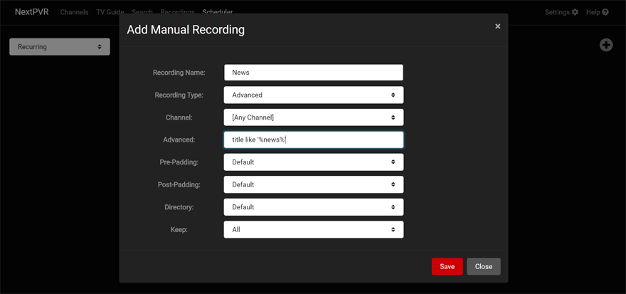

Similar to the Keyword recording functionality, but a little more complicated, and little more powerful is the Advanced Recordings feature. To access this, head to the Scheduler Page, and click the '+' button in the upper right of the page. This will show you the Manual Recording popup.

On the Manual Recording popup, you can set the recording type to 'Advanced'. You'll then be shown a field for entering an Advanced recording rule.

An advanced recording rule is effectively a SQL clause, used for querying the database to find matching shows. These queries can range from very simple to incredibly complicated, but give you the flexibility to record based on all sorts of criteria.

### examples
Record all shows with 'news' in the title.
> title LIKE '%news%'

Record all shows with 'news' in the title which fall within a set time period 
> title LIKE '%news%' AND time(start_time,'localtime') >= time('17:00:00') AND time(start_time,'localtime') <= time('20:00:00')