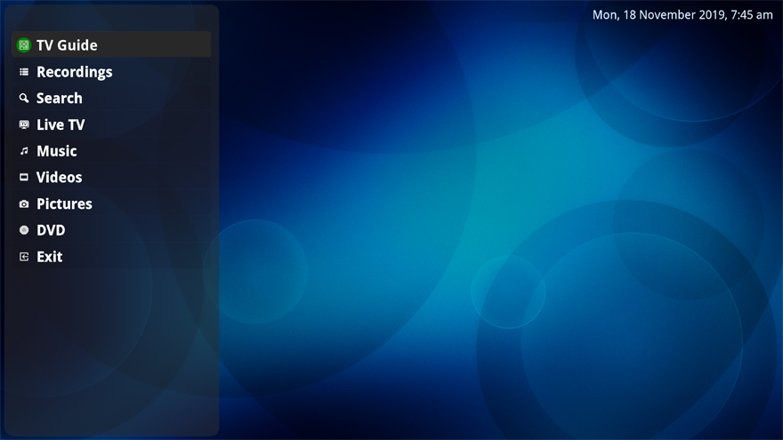

### The latest files can be downloaded from:
The 64bit Windows build can be downloaded from:
http://nextpvr.com/beta/windows/NPVR.zip

The 32bit Windows build can be downloaded from:
http://nextpvr.com/beta/windows/NPVR.zip

### To install and run on Windows
copy binaries to directory like C:\Program Files\NPVR  
run NextPVRServer.exe

### Windows Client
The windows client, nextpvr.exe, is included in the 'client' subdirectory. At this stage it can only connect to NextPVR running on the same Windows machine.

A tray app is also available, which can give you a visual indication of when the application is recording or idle. This can run using NPVRTray.exe.