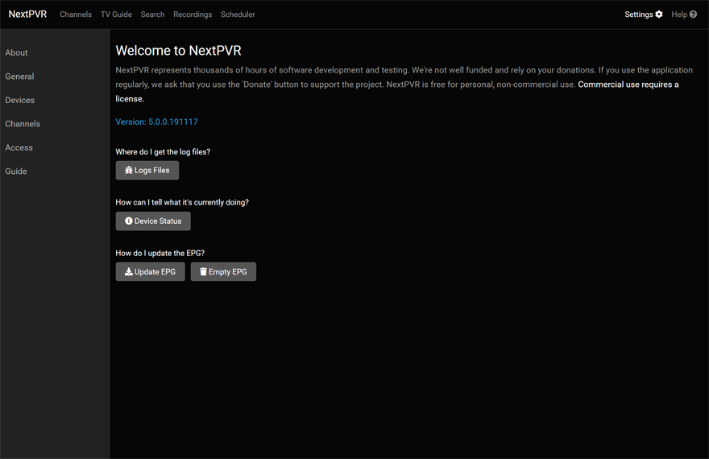
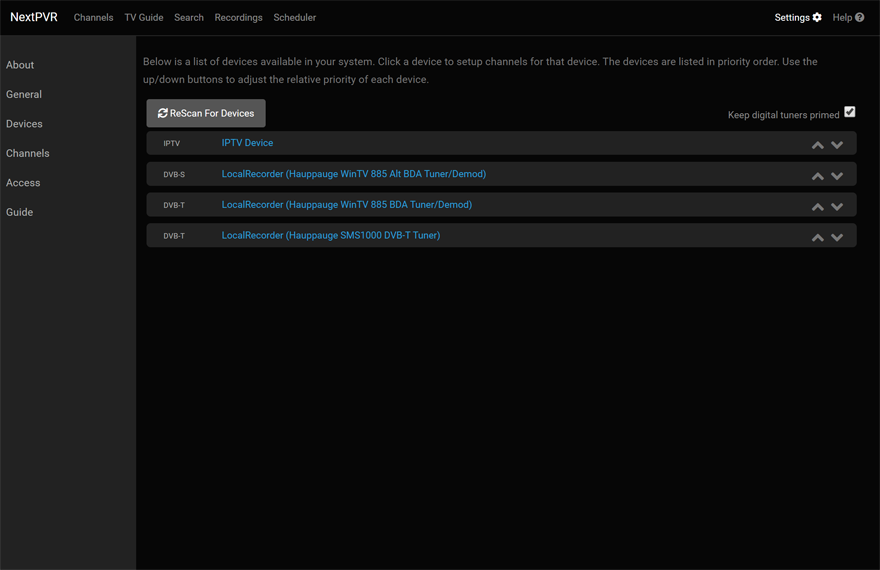
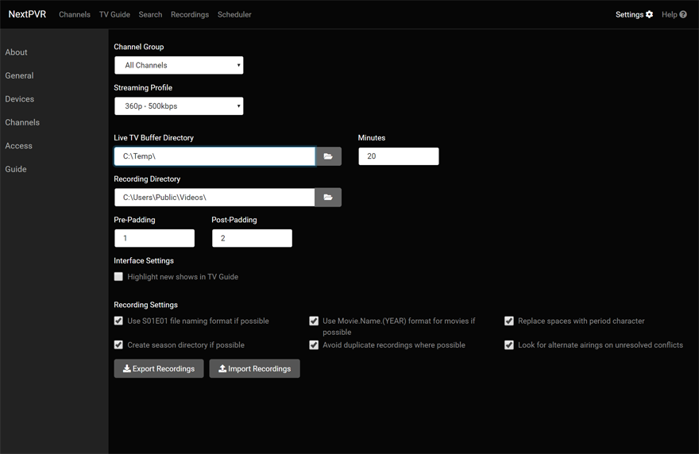
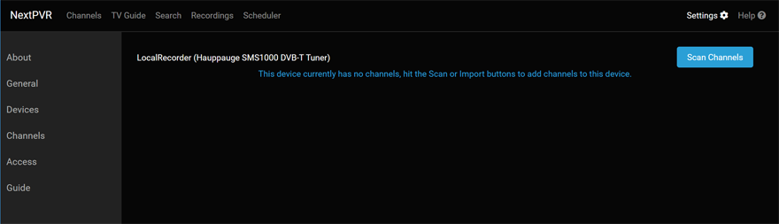
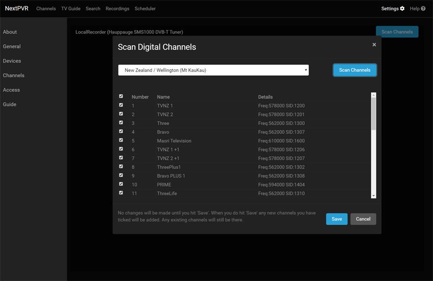

After installing NextPVR, you can access it viewing http://localhost:8866/index.html. Initially you'll be presented with the login page. The default login is 'admin/password'.

For initial setup, you'll need to head to the Settings page, by clicking on Settings at the right side of the top navigation bar.

### Where to from here?

The usual steps for setup would be to head to the Settings -> Devices page to setup your channels. You'd also typically head to the Settings -> General page, to ensure your recording directory etc are set to an appropriate location.

Below is a picture of the Settings -> Devices page. The devices you see here will vary depending on the devices you have available on your machine, or local network (in the case of network tuners). You can click on a device to setup/scan for channels on that device. The exact settings you'll see will vary depending on the type of device.

Below is a picture of the Settings -> General page. Key settings here are the 'Recording Directory' and 'Live TV Buffer Directory'. These should both be set to a directory that exists.

### Example device (DVB-T)

As mentioned above, clicking on a device in the Settings -> Devices page wll get settings page for that device. The exact settings for that device will vary depending on what device needs.  Below is an example of a DVB-T device. Initially the device is empty, with no channels. 

Clicking the Scan Channels button will show a popup window for scanning the device. In this specific case, I chose my local region and hit the 'Scan Channel' button to start the scan. 

At the end of the scan, the channels found are listed, and I can hit 'Save' to store these channels.

