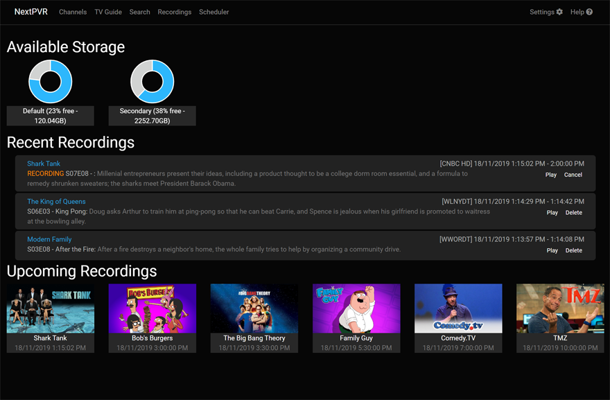
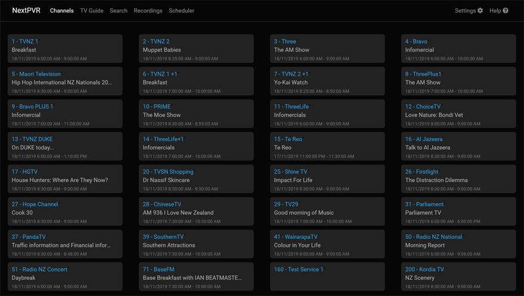
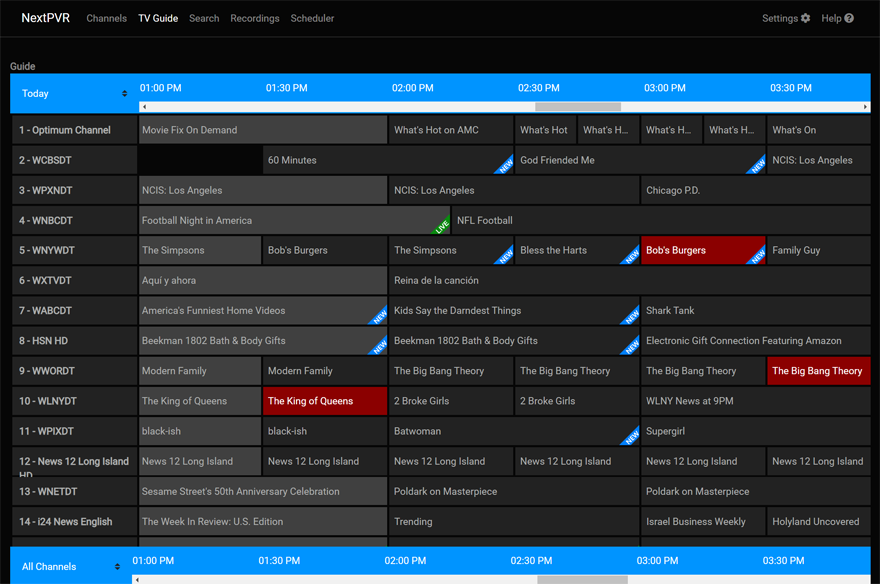
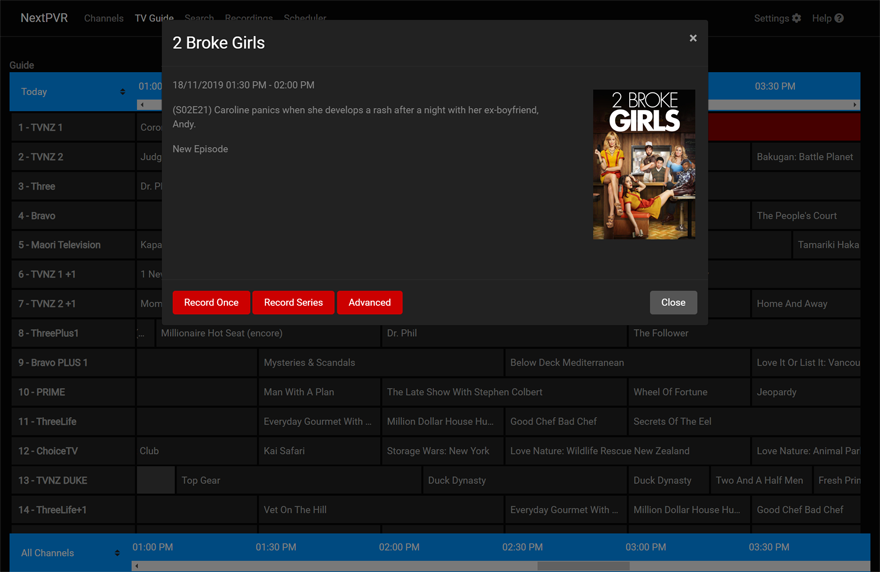
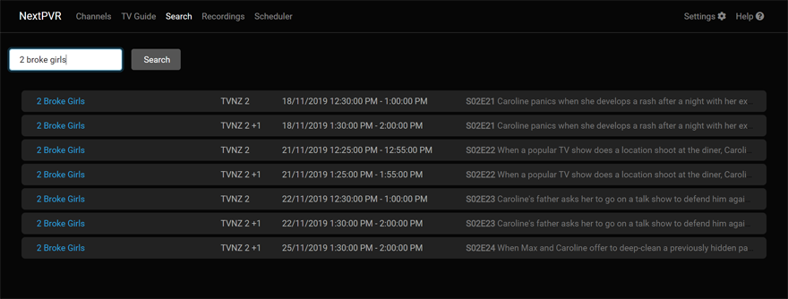
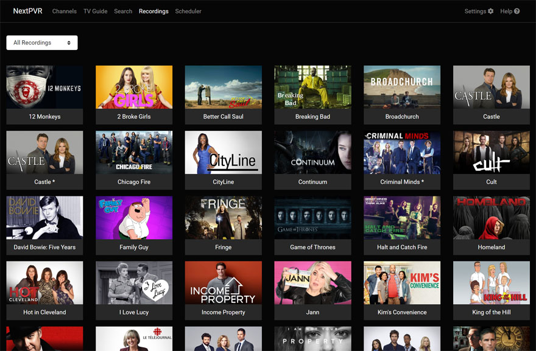
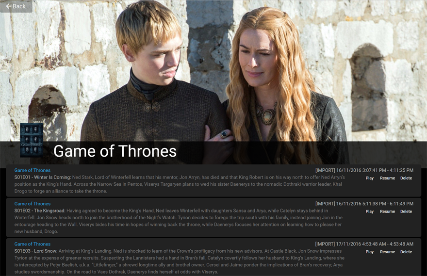
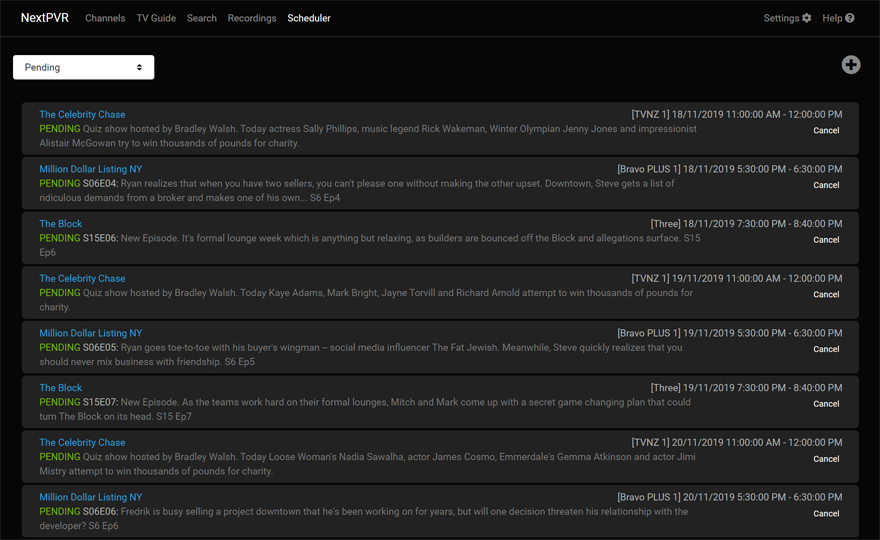

You can access the web application viewing http://localhost:8866/index.html in your web browser. Initially you'll be presented with the login page. The default login is 'admin/password'.

After logging in, you'll find a relatively straight forward layout to the web application. You'll initial start out on the home page, which gives you a summary of your available disk space, and info about recent activity.

Along the top of the web app is the navigation bar, where you can choose pages for the commonly used activities. In the sections below we'll give a brief over view of each of these pages.

#### Channels
The Channels page provide a simple list of your channels, and what is one each channel. Simply click a channel to begin watching that channel. 

#### TV Guide
The TV Guide page provides a grid of the TV listings for each channel. You can use the vertical scroll bars to scroll down through channels. You can use the horizontal scroll bars to scroll to different times ofthe day. You can click the day selector at the top left of the grid to select a different day. You can select the channel group selector at the bottom left of the grid to select a different channel group. 

When you click a TV show, you'll see the details for that show, and buttons to allow you schedule that show to be record. 

#### Search
The Search page provides you a way to search for a specific show. Simply enter a keyword or phrase and hit 'Search'. It'll find any show with that text in the title or description.

#### Recordings
The Recordings screen shows you view the lists of recordings you have available to watch. The default view is the 'all recordings' grid, which groups the recordings by show title. 

Clicking on a show will give you the list of individual shows that are available to record. 

#### Scheduler 
The Scheduler screen allows you to view and manage your list of upcoming recordings. The drop down at the top left allows you to switch been the list of pending recording (individual shows that'll be recorded), and recurring recordings (recordings that happen repeatedly)

#### Settings
The Setting screen provides the functionality required to setup and maintain NextPVR. For more details on Settings, see:
[Setup](Setup-Main)